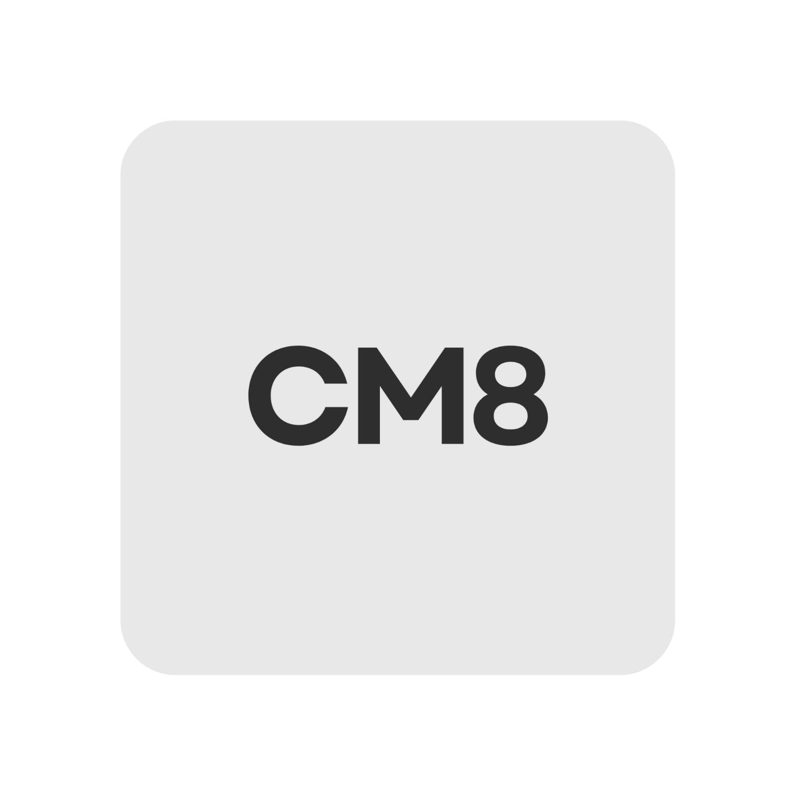
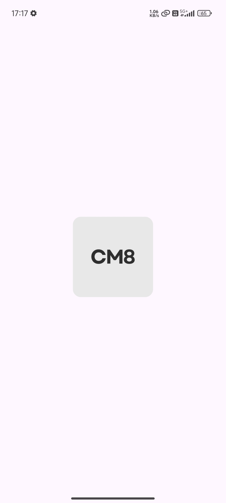
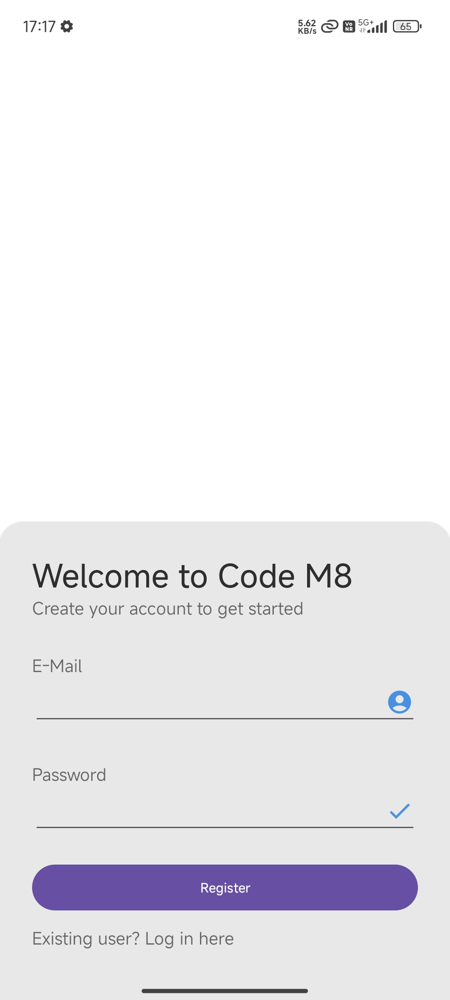
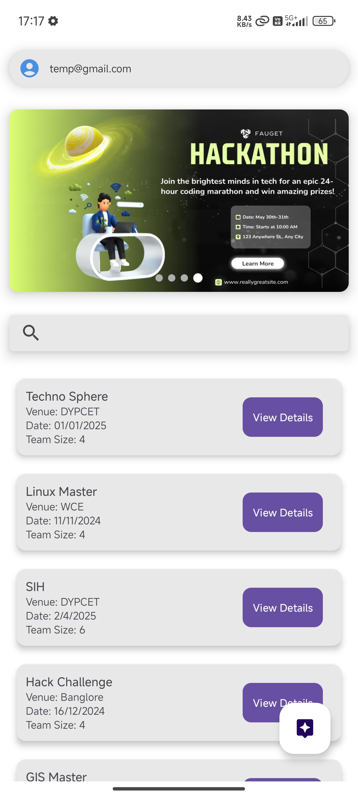
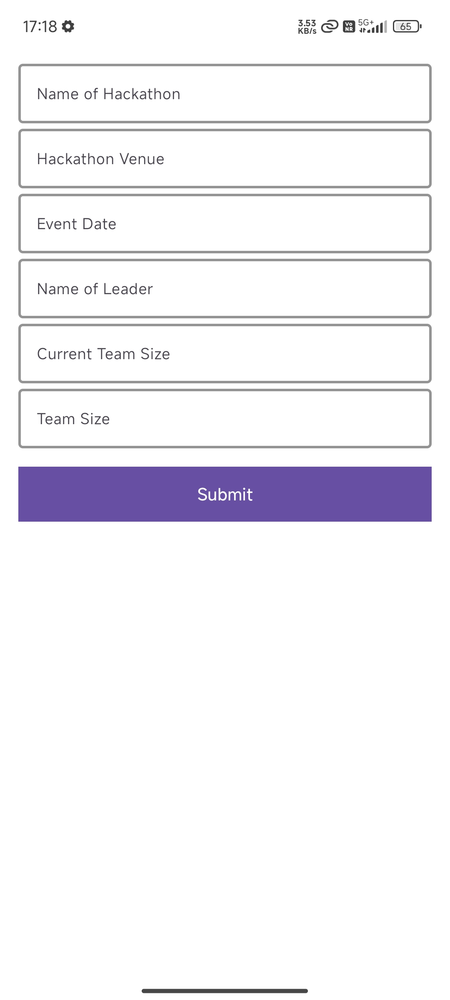
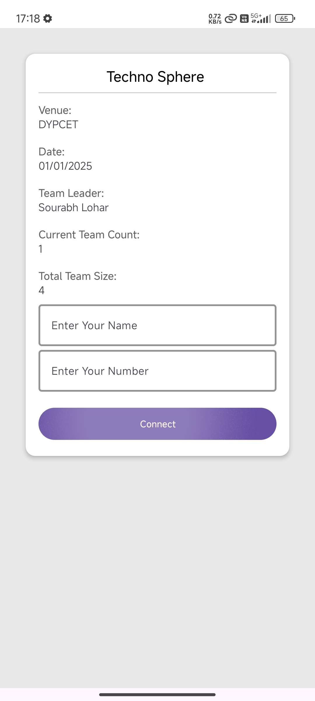

  
  <h1 style="margin: 0; vertical-align: middle;">Code M8</h1>

**Code M8** is a platform designed to simplify the team-building experience for hackathon participants. In the fast-paced and competitive environment of hackathons, finding the right teammates with complementary skills and interests can be challenging. Code M8 helps users connect with potential teammates, collaborate, and form teams based on shared goals and expertise.

By providing a space to post detailed team requirements, browse potential teammates, and join teams for various hackathons, Code M8 ensures that participants find the best fit for their needs. The platform also allows users to explore ongoing and upcoming hackathon events, connect with teams, and foster innovation in a community-driven environment.

### Features
- Connect and collaborate with teammates for hackathons.
- Post detailed team requirements and browse potential candidates.
- View ongoing and upcoming hackathon events.
- Join teams that align with your skills and goals.
- Enhance the overall hackathon experience by simplifying team formation.

---

## Technologies Used

- **Android Studio**: The primary IDE used to develop the app.
- **Java**: The programming language for backend logic and functionality.
- **Firebase**: For backend services such as authentication, real-time database, and storage.

---

## Screenshots

  
  
  
  

  
  
  

---

## Download APK

You can download the APK file for installation from the link below:
[Download APK](assests/cm8.apk)

---

## Contributing

If you'd like to contribute to Code M8, please follow the guidelines below:

### Do's
- Make the image slider dynamic to change images automatically.
- Add a panel where users can see all hackathons listed by others.
- Include a help panel that provides instructions on how to use the app.

### Don'ts
- Do not change the user interface design.

---

